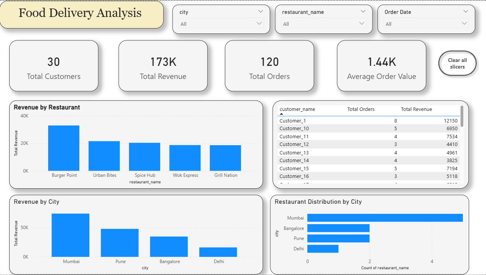

Food Delivery Data Analysis (SQL Project)
📌 Project Overview

This project analyzes a food delivery dataset using SQL to uncover insights about customers, restaurants, orders, and revenue trends.
The goal of the project is to simulate real-world data analyst work, focusing on writing efficient SQL queries and deriving business insights.

🗂️ Dataset Description

The analysis is based on four relational tables:

customers – customer details such as name and city

restaurants – restaurant details including city and cuisine

orders – order-level information with total order amount

order_items – item-level order details

The dataset structure allows performing joins, aggregations, window functions, and conditional logic.

🎯 Key Business Questions Answered

The project answers 10 business-focused questions, grouped by difficulty:

🟢 Easy

Total number of orders

Total revenue generated

Total number of customers

Number of restaurants in each city

🟡 Medium

Top 5 restaurants by total revenue

Total orders placed by each customer

Average order value per restaurant

🔴 Advanced

Customers who placed more than 5 orders

Top 3 restaurants in each city by revenue (using window functions)

Customer classification based on total spend

🛠️ SQL Concepts Used

JOIN (INNER JOIN)

GROUP BY

Aggregate functions (SUM, COUNT)

HAVING

Window functions (RANK() OVER)

Subqueries

CASE WHEN for business classification

Sorting and filtering

📊 Key Insights

Identified top-performing restaurants by revenue across cities

Segmented customers into Premium, Gold, and Regular based on spending behavior

Highlighted high-frequency customers who placed more than 5 orders

Compared restaurant performance using average order value (AOV)

📁 Project Files

food_delivery_analysis.sql – contains all SQL queries with comments

🚀 Outcome

This project demonstrates the ability to:

Translate business questions into SQL queries

Work with relational datasets

Apply analytical thinking using SQL

Write clean, readable, and interview-ready SQL code
## Power BI Dashboard
• Built an interactive Power BI dashboard to analyze revenue, orders, and customer behavior  
• Designed KPIs for Total Revenue, Total Orders, Total Customers, and Average Order Value  
• Created bar charts for revenue by restaurant and city, and a customer-level performance table  
• Added slicers for city, restaurant, and order date to enable dynamic filtering

## Dashboard Preview

